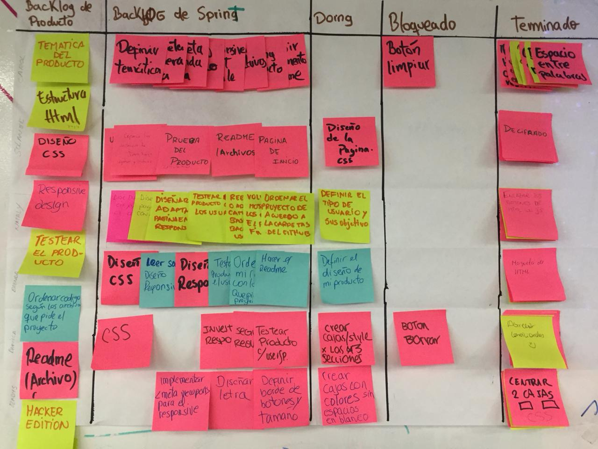
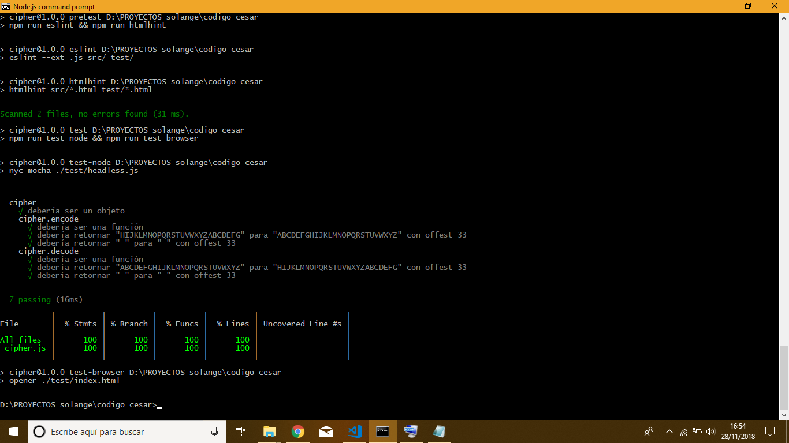
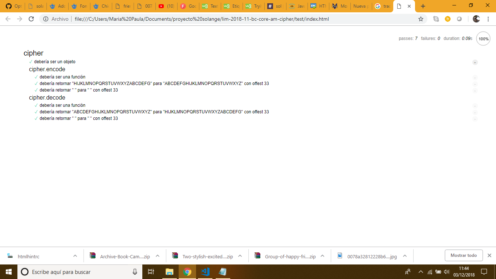

# Friends  Secret

     Alguna vez has hablado con tus amigas de algun tema que no quieres 
     que nadie se entere y de pronto aparece tu mamá,hermano o tu profesor 
     a tu costado, asomando la cabeza para poder leer tus conversaciones...

 

     Quieres hablar de manera SECRETA con tus Friends 
     sin que nadie se entere de lo que están hablando? , y de forma divertida
     Prueba nuestra aplicación ** FRIENDS SECRET ** manda mensajes secretos 
     y que tus amigas los descifren y descifra los que ellas te enviaran.

## ¿Quieres saber como funciona?

1. Escribir un mensaje o copia el mensaje creado que te enviaran tus amigas.
2. Elige la acción que quieras realizar crear ó descifrar.
3. Ingresar una clave la cual permitira realizar el desplazamiento del mensaje.
4. Que aparesca el mensaje con la acción que hemos seleccionado. 

Friends Secret es una de las aplicaciones más simples para cifrar un mensaje. Es un tipo de cifrado por sustitución, es decir que cada letra del texto original es reemplazada por otra que se encuentra en el mismo alfabeto.

Por ejemplo, si usamos un desplazamiento (_offset_) de 3 posiciones:

- La letra A se cifra como D.
- La palabra CASA se cifra como FDVD.
- Alfabeto sin cifrar: A B C D E F G H I J K L M N O P Q R S T U V W X Y Z
- Alfabeto cifrado: D E F G H I J K L M N O P Q R S T U V W X Y Z A B C

### Objetivo

El objetivo principal de esta aplicación es que adolescentes (género femenino) puedan comunicarse por redes sociales de manera secreta con sus amigas sin que un adulto u otra persona, se entere del tema que estén hablando, y sobre todo sin el temor de ser juzgadas.

* Planificación.

En la fase de planeación se determino las actividades a realizar en el proceso,
deacuerdo a los Sprint según la metodología de SCRUM
Actividades a realizar para el desarrollo del producto:

* Identificación del problema.
* Análisis y diseño del prototipo.
* Desarrollo de la codificación del producto.
* Realización de pruebas.

#### Testing Unitario 

Para esta fase se relizo las pruebas unitarias del código, mediante el uso de Framework como MOCHA, permitiendo mejorar la codificacion e interación con el usuario.

   

#### Ingresar a la Aplicación

Estas lista para poder mandar tus mensajes secretos 
* Entrar al link (https://solangesalvatierra.github.io/lim-2018-11-bc-core-am-cipher/src/) 

#### Requerimientos de Proyecto
* [ ] `README.md` incluye info sobre proceso y decisiones de diseño.
* [ ] `README.md` explica claramente quiénes son los usuarios y su relación con
  el producto.
* [ ] `README.md` explica claramente cómo el producto soluciona los
  problemas/necesidades de los usuarios.
* [ ] Usa VanillaJS.
* [ ] No utiliza `this`.
* [ ] Implementa `cipher.encode`.
* [ ] Implementa `cipher.decode`.
* [ ] Pasa linter con configuración provista.
* [ ] Pasa pruebas unitarias.
* [ ] Pruebas unitarias cubren 70% de _statements_, _functions_ y _lines_, y un
  mínimo del 50% de _branches_.
* [ ] Interfaz permite elegir el `offset` o _desplazamiento_ a usar en el
  cifrado/descifrado.
* [ ] Interfaz permite escribir un texto para ser cifrado.
* [ ] Interfaz muestra el resultado del cifrado correctamente.
* [ ] Interfaz permite escribir un texto para ser descifrado.
* [ ] Interfaz muestra el resultado del descifrado correctamente.

